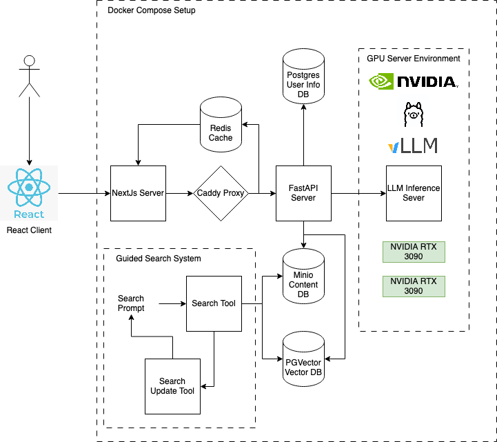
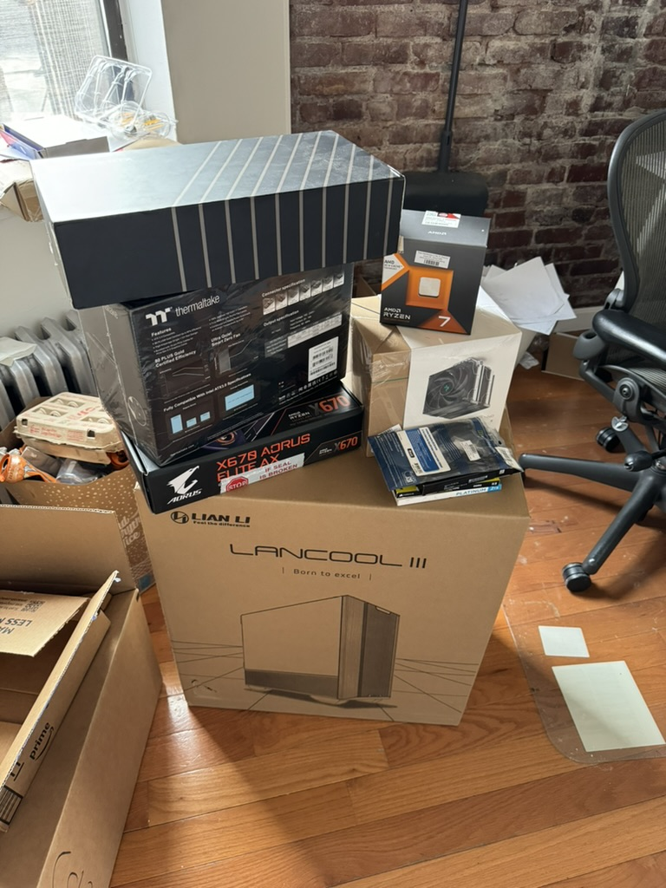
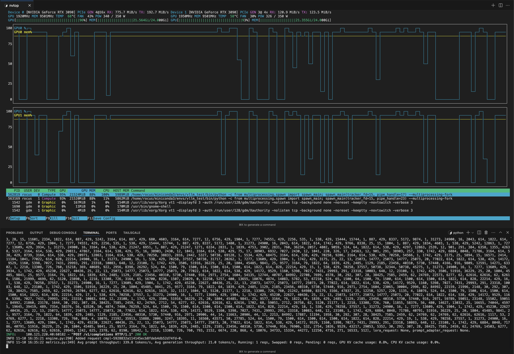

# 🎭 Fashion Analyzer

Fashion Analyzer is your personal AI-powered fashion assistant that brings together cutting-edge local LLM technology with modern web architecture. Built with a FastAPI backend and React frontend, this application revolutionizes how we analyze and discover fashion trends.

🌟 Key Capabilities:
1. **Trend Analysis**: Get real-time insights and comprehensive analysis of the latest fashion trends, powered by state-of-the-art AI models
2. **Smart Fashion Search**: Utilize our specialized AI search engine to discover clothing items across the web with unprecedented accuracy and relevance
3. **Weekly Recap**: Get a weekly recap of the latest fashion trends and insights

🚀 What makes us unique? Fashion Analyzer runs entirely on local models, leveraging the power of [vLLM](https://github.com/vllm-project/vllm) for lightning-fast LLM inference. This means superior performance, complete privacy, and no dependency on external API services.

## Demo Video

## Architecture

- **FastAPI Backend**: Provides a robust and high-performance API for image analysis.
- **React Frontend**: A modern and responsive user interface for uploading and viewing fashion images.
- **Docker Compose**: Simplifies the setup and management of the application by coordinating multiple containers.
- **Redis**: Used for caching and session management.
- **Caddy**: Used as a reverse proxy to manage incoming requests and route them to the appropriate backend service.
- **PGAdmin**: Used for storing and querying embeddings as well as other database management.
- **Intelligent Search System**: Uses LLM-guided Tavily queries to efficiently discover and analyze fashion content.

### Architecture Diagram


## Behind the Scenes
Significant effort was required at the hardware and networking levels to get the application running. In particular, I needed a machine capable of running a 70B parameter LLM and a network to allow my application to access the server securely. I created the network between my sever and development machines with the [Tailscale Network](https://tailscale.com/).

### Building an LLM Inference Server
LLMs are possible to run with consumer hardware! Given 2 32GB VRAM GPUs, I was able to run a 70B parameter LLM with strong performance for this app! It required building a custom server with a 1600W power supply, 2 RTX 3090 GPUs, and 128 GB of RAM to handle the model weights for training and inference.






## Prerequisites

- Docker
- Docker Compose
- An LLM server with support for Ollama for vLLM
- Playwright (install with `playwright install`)

## Getting Started

### Clone the Repository
```bash
git clone https://github.com/GageWAnderson/fashion_analyzer.git
cd fashion_analyzer
```

### Installing Dependencies
If running outside the containers, install the frontend and backend dependencies as follows. Otherwise, skip to the LLM server section as those will be managed by docker compose.

#### Frontend Dependencies
To install frontend dependencies, navigate to the frontend directory and use pnpm:
```bash
cd frontend
pnpm install
```

#### Backend Dependencies
The backend dependencies are managed by poetry, so install with the following:
```bash
poetry install
```

#### Pre-commit Hooks
To install pre-commit hooks for development, run:
```bash
poetry run pre-commit install
```

#### Crawler Dependencies
To install the crawler dependencies, run the following. Note that playwright is required to run the crawler outside the containers, and must be installed separately.
```bash
poetry install
playwright install
```

#### Pre-commit Hooks
To install pre-commit hooks, run:
```bash
poetry run pre-commit install
```

### LLM Server Setup
It is recommended to run the LLM server on a separate machine from the rest of the application. Choose a machine with an NVIDIA GPU for optimal performance, although AMD GPUs and Mac MLX may be supported as well.
When running this application, there are 2 primary options for the LLM server:
1. [Ollama](https://ollama.com/)
    - **Ollama is not meant for large scale LLM deployment** since it only supports 1 request at a time and lacks a sophisticated caching system
    - Ollama is a lightweight, open-source, and easy-to-use LLM server
    - Ollama is excellent at getting started quickly since its interface is simple
    - Ollama is also excellent at running larger models on limited hardware since it chooses optimal quantization methods and doesn't use significant VRAM overhead for attention cachine
2. [vLLM](https://github.com/vllm-project/vllm)
    - vLLM is a high-throughput, high-quality inference engine for LLMs
    - vLLM supports concurrent requests and has a sophisticated caching system
    - vLLM is more difficult to setup and configure, but is more scalable and powerful for large scale LLM deployment

#### Ollama
To leverage [Ollama](https://ollama.com/) for LLM inference, install the required models. Do this by running the following command:
```bash
sudo apt-get install -y ollama
ollama pull model_name
ollama serve
```
Download `llama3.1` and `nomic-embed-text` models to get started, change the `backend/app/config/config.yml` file to use different LLMs. Use the `ollama_` prefix in the config file to tell the application to use Ollama.

#### vLLM
To leverage [vLLM](https://github.com/vllm-project/vllm) for LLM inference, install vLLM dependencies in the python environment and start the server with the following commands:
```bash
conda create -n vllm python=3.10
conda activate vllm
pip install vllm # Note that pip should be used instead of conda to avoid low-level dependency resolution issues

# This is an example command, tweak the parameters as needed for the available hardware
vllm serve meta-llama/Llama-3.1-8B-Instruct --dtype bfloat16 --max_model_len 4096 --tensor_parallel_size 2 --chat-template tool_chat_template_llama3.1_json.jinja --tool-call-parser llama3_json --enable-auto-tool-choice --port 8000
```

Here is another example command to use Mistral instead of Llama:
```bash
vllm serve mistralai/Mistral-7B-Instruct-v0.3 --dtype bfloat16 --max_model_len 4096 --tensor_parallel_size 2 --tokenizer_mode "mistral"
```

Feel free to experiment with different underlying models! The model choice is fully configurable in the `backend/app/config/config.yml` file.

Note that vLLM requires significantly more VRAM for a given number of model weights due to its sophisticated paged attention caching system. This makes its inference incredibly efficient in parallel, but may reduce the maxiumum parameter cound (and therefore intelligence) of the model hosted.

## Testing

### Running the tests
The application uses pytest to run the test suite. To run the tests, navigate to the root directory and run:
```bash
poetry run pytest -v -s
```
Under the hood, the tests use [Deep Eval](https://docs.confident-ai.com/) to check the LLM responses. The built-in Deep Eval RAGAS metrics are particularly useful for evaluating the model's performance on the RAG questions.

### Creating a Test Report
The tests also output a test report in HTML format, which is viewable in any modern web browser. To view the test report, navigate to the `tests/test_outputs` directory and open the `test_report.html` file.
The report file includes plots of the pass rate overall, by tool, by eval metric, and by latency. It uses Deep Eval RAGAS metrics to evaluate the performance of the LLM on the RAG questions and responsible AI metrics to evaluate the responses for potential harm.

#### Example Report Sections

##### Overall Pass Rate
The overall pass rate plot shows the percentage of tests that passed across all test cases. This gives a high-level view of the system's performance.

##### Router Pass Rate 
The router pass rate plot shows how well the system routes queries to the appropriate tools and subgraphs.

##### Pass Rate by Tool
This section breaks down the pass rates for each individual tool in the system (e.g. clothing search, outfit generator, etc).

##### Evaluation Metric Breakdown
The evaluation metrics plot shows scores for different RAGAS metrics like answer relevance, context relevance, and faithfulness.

##### Latency Analysis
The latency breakdown plot shows response time distributions across different components and tools in the system.

### Setting up the Environment
To set up the environment, follow the `.env.example` file found in the root and frontend directories. Fill in the missing values, with the connection strings for the LLM servers and databases.

#### Running the Application
If running outside the containers, start the frontend and backend as follows. Otherwise, skip to the Docker section.

#### Start the Frontend
To start the frontend, run:
```bash
cd frontend
pnpm install
pnpm run prisma:generate
pnpm run dev
```

#### Start the Backend
To start the backend, run:
```bash
poetry install
poetry run uvicorn backend.app.main:app --reload --port 9090
```

### Run the Application
To run the application, navigate to the root directory and run:
```bash
docker-compose -f docker-compose.yml up -d --build
```
This will start up all the containers required to run the application.

### Run the Web Crawler
To run the web crawler, use the Poetry script. Make sure playwright is installed in the python environment.
```bash
poetry run crawler
```

## Contributing

Contributions are welcometo the Fashion Analyzer project! If you have any ideas or suggestions, please feel free to open an issue or submit a pull request.

## References
- [LangGraph](https://www.langchain.com/langgraph)
- [Ollama + LangGraph](https://www.youtube.com/watch?v=Nfk99Fz8H9k)
- [vLLM](https://github.com/vllm-project/vllm)